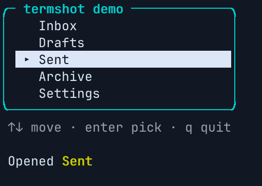

# termshot screens

A GitHub Action built on [termshot](https://github.com/momiji-rs/termshot), which replays a
raw PTY log into a PNG of the final screen.

Screenshot your CLI or TUI in CI, and see on the pull request what changed.



Two workflows, so the job that runs your code never holds a write token:

```yaml
# .github/workflows/screens.yml: builds and runs your program, can't write
name: screens
on:
  pull_request:
  push:
    branches: [main]

permissions:
  contents: read   # for actions/checkout; a public repository can use {}

jobs:
  screens:
    runs-on: ubuntu-latest
    steps:
      - uses: actions/checkout@v4
      - run: cargo build --release   # or whatever builds your program
      - uses: momiji-rs/termshot-action@v0
        with:
          mode: render
          shots: |
            help: ./target/release/myapp --help
            list@120x20: ./target/release/myapp list --color=always
            inbox: ./target/release/myapp
              wait-for Inbox
              key down down
              snap selected
              type hello
              key enter
```

```yaml
# .github/workflows/screens-publish.yml: publishes, never runs your code
name: screens-publish
on:
  workflow_run:
    workflows: [screens]
    types: [completed]

permissions:
  contents: write        # store the images on the termshot-assets branch
  pull-requests: write   # post the comment
  actions: read          # private repositories only: download the artifact

jobs:
  publish:
    runs-on: ubuntu-latest
    steps:
      - uses: momiji-rs/termshot-action@v0   # mode publish, from the event
```

This covers pushes, pull requests from branches, pull requests from forks, and Dependabot. See
[Permissions](#permissions) for why it is split, and for a one-file setup.

Each pull request gets **one comment, updated in place on every push**:

- **changed** screens show before and after side by side, a **diff image** (the new screen with
  every changed cell at full strength and the rest dimmed, so a colour-only change shows too),
  and a diff of their text
- **new** screens are shown in full, and **removed** ones are listed
- **unchanged** screens fold into one line

## Guides

- [Bubble Tea](docs/bubbletea.md): your teatest golden files are already screenshots. Point `logs` at
  `testdata/*.golden`, and each pull request shows the screens its tests check.

## Shots

A shot is `name: command`, or `name@COLSxROWS: command` for a size other than `size`. The
command runs under bash in a real PTY of that size, with `TERM=xterm-256color`, so programs
colour and lay out their output as they would for a person.

With no steps, the screen is taken when the command exits, or at `timeout` if it is still running
(a TUI). Indented lines below a shot drive it instead:

| step | |
|---|---|
| `wait 0.5` | let it run for that many seconds |
| `wait-for TEXT` | until TEXT is on the screen (termshot reads the screen as it goes) |
| `type TEXT` | type TEXT |
| `key NAME …` | press keys: `enter`, `tab`, `esc`, `space`, `backspace`, `up`, `down`, `left`, `right`, `home`, `end`, `pgup`, `pgdn`, `delete`, `f1`–`f12`, `shift-tab`, `ctrl-c`, `alt-x`, or one character |
| `snap NAME` | take a screen now, as `<shot>.NAME` |

After the last step the final screen is taken as `<shot>`. A program still running then is
killed after recording has stopped, so its exit cleanup (leaving the alternate screen) never
reaches the image.

`logs: 'tests/screens/*.pty@100x30'` takes PTY logs you recorded yourself instead.

## How it works

1. **Render.** termshot turns each log into a PNG, its `--text` and its `--json`. It needs no
   browser, ffmpeg, Python or font setup. The work is done by one static binary,
   [gh-termshot](https://github.com/momiji-rs/gh-termshot) (`core-version`), which links the termshot
   library and is checked against its release's SHA256SUMS before it runs. The runner needs bash and
   curl, and unzip to publish a fork's screens.
2. **Compare.** termshot is deterministic, so the same screen gives the same bytes on every runner,
   and a change is exact rather than a pixel-tolerance guess. A push to a branch stores that
   branch's screens as its baseline. A pull request compares with the baseline of its base branch.
   The diff is per cell, from `--json` (character, colours, attributes), and termshot draws it:
   the action writes a log of the new screen with the changed cells lit and renders that.
3. **Store.** GitHub has no API for uploading images to comments, so the files are committed to an
   orphan branch, `termshot-assets`, which never touches your history. It is content-addressed:
   each file is `objects/<sha256>` and is never rewritten, so a screen that didn't change is not
   stored again and old comments keep their images.
4. **Prune.** A push removes what pull requests closed more than `retention-days` ago (30) used
   alone, and the baselines of deleted branches, and squashes the branch's history so the space
   is freed. Comments on those pull requests then lose their images.

Set `fail-on-change: true` to make a changed screen fail the check, like a snapshot test. The
report also goes to the job summary, and every log, PNG and text to the `termshot-<id>` artifact.

## Permissions

The action needs no secret, no app and no service outside GitHub: it stores images with the
workflow's own `GITHUB_TOKEN`. Measured on github.com on 2026-10-07, by running each job with
one permission fewer and watching it fail:

| job | public repository | private repository |
|---|---|---|
| `mode: render`, which runs your code | `{}`: checkout, capture and artifact upload all work | `contents: read`: checkout fails without it |
| `mode: publish` | `contents: write`, `pull-requests: write` | the same, plus `actions: read` |

What each one is for, and what you get without it:

| permission | what for | without it |
|---|---|---|
| `contents: write` | committing images to the `termshot-assets` branch (`POST /git/blobs` returns 403 without it) | no images: set `publish: false`, and the comment has the text diff only |
| `pull-requests: write` | posting and updating the comment (403 without it; `issues: write` also works) | no comment: the report is in the job summary only |
| `actions: read` | downloading another run's artifact | private repositories: listing the run's artifacts returns 403. Public ones need any token, with no permission |

### Why images need `contents: write`

GitHub offers no narrower way to put an image in a comment. Measured on 2026-10-07:

- The REST API's comment endpoints take a `body` string and nothing else. A `GITHUB_TOKEN` can't
  create a gist (403).
- The web UI's upload form (`github.com/upload/policies/assets`) ignores API tokens and wants a
  browser session. With or without a token, it returns the same 422 page.
- `gh issue comment --attach` and `gh pr comment --attach` (gh 2.102, September 2026) upload to
  `uploads.github.com/user-attachments/assets`. An OAuth token can upload there (201). A
  `GITHUB_TOKEN` gets 404, even with `contents`, `issues` and `pull-requests` write. gh refuses
  it before sending ("unsupported authentication type"), and lists only OAuth, classic and
  fine-grained personal access tokens and GitHub App user tokens.

The publish workflow could upload with a personal access token kept as a secret, because
`workflow_run` jobs get secrets. That isn't implemented. Such images would be uploaded as that
person, couldn't be deleted, and would put a long-lived user token in CI.

### Why two workflows

`contents: write` lets a token push to any branch the rules don't protect, and create tags. A job
that builds and runs your program runs your dependencies too. `actions/checkout` leaves the token
in `.git/config`, so a compromised dependency could push with it. Splitting the work keeps that
token out of reach:

- **`mode: render`** captures and renders with no write permission, and makes no API calls at all. It
  leaves the logs, and a bundle describing them, in the `termshot-<id>` artifact.
- **`mode: publish`** runs on `workflow_run`, from your default branch, in a job that checks out
  nothing and runs nothing of yours. It treats the artifact as untrusted data:
  - It reads the zip in memory, under a size limit, and never unpacks it to disk.
  - It checks every screen name and size.
  - It ties the bundle to the run that made it. A pull request must be open, and its head commit
    and repository must be the run's. A push must still be the branch's head.
  - It renders the logs with its own termshot, which is built to read hostile input, and doesn't
    trust images from the run.
  - It runs nothing from the artifact.

What each event's token can do:

| event | token | the action |
|---|---|---|
| `push` | what `permissions:` grants | `render`: the publish workflow stores the branch's baseline and prunes |
| `pull_request` from a branch of the repository | what `permissions:` grants | `render`: the publish workflow compares and comments |
| `pull_request` from a fork, or by Dependabot | **read-only, whatever `permissions:` says**, and no secrets | renders only, in any mode |
| `workflow_run` | what `permissions:` grants, in the base repository, from the default branch | `publish` |

Don't use `pull_request_target` instead: it has a write token, and checking out the fork's code
under it is how repositories get compromised.

### One workflow, two jobs

If you take no pull requests from forks, one file will do. The second job downloads the first's
artifact within the same run, with `actions/download-artifact`, so it doesn't need `actions:
read` even in a private repository:

```yaml
permissions: {}

jobs:
  render:
    runs-on: ubuntu-latest
    permissions:
      contents: read
    steps:
      - uses: actions/checkout@v4
      - run: cargo build --release
      - uses: momiji-rs/termshot-action@v0
        with:
          mode: render
          shots: |
            help: ./target/release/myapp --help

  publish:
    needs: render
    runs-on: ubuntu-latest
    permissions:
      contents: write
      pull-requests: write
    steps:
      - uses: actions/download-artifact@v4
        with:
          name: termshot-termshot
          path: screens
      - uses: momiji-rs/termshot-action@v0
        with:
          bundle-dir: screens
```

On a fork's pull request every job's token is read-only, so the publish job explains that and does
nothing.

### When the renderer is what you test

The publish job renders the logs again with the action's own termshot, so it never trusts
images from the render job. If your project's change *is* the rendering (a renderer, a
terminal emulator, termshot itself), that hides the change. Use `images: bundle` instead: the
publish job takes the PNG, text and JSON the render job made, as untrusted data. Each must be
what termshot writes: a PNG under 16384 px a side, a `--json` screen of the shot's size with
`#rrggbb` colours, under size limits. It only takes these from runs of the repository's own
branches, never a fork's.

```yaml
  publish:
    needs: render
    permissions:
      contents: write
      pull-requests: write
    steps:
      - uses: actions/download-artifact@v4
        with:
          name: termshot-termshot
          path: screens
      - uses: momiji-rs/termshot-action@v0
        with:
          bundle-dir: screens
          images: bundle
```

### The simplest setup

With no `mode`, one job captures, renders and publishes, given `contents: write` and
`pull-requests: write`. It's shorter, but everything that job runs holds the write token: your
build, the commands of your shots, and the termshot it renders with. The action gives the
commands it runs an environment without `INPUT_*` and token variables, but that is defence in
depth, not a boundary: a program in the job can still read its parent's environment. Use it only
for code you trust as much as the token.

A run whose commit is no longer the pull request's head, or the branch's, doesn't publish, so an
older run that finishes last can't overwrite a newer one. A `concurrency` group with
`cancel-in-progress: true` saves the run as well.

### Settings that can get in the way

- **Allowed actions.** An organization that allows only selected actions has to allow
  `momiji-rs/termshot-action@*`.
- **Rulesets and branch protection.** A ruleset that targets all branches can stop
  `GITHUB_TOKEN` from creating `termshot-assets` or force-pushing it when pruning. Exclude the
  branch from the ruleset, or set `retention-days: 0`.
- **Private repositories.** Image URLs are `github.com/<repo>/raw/termshot-assets/…`. A
  signed-in viewer with access sees them in the comment. Signed out, or with an API token, they
  return 404 (verified 2026-10-07). A fork of a private
  repository gets a write token only if the repository allows it ("Send write tokens to workflows
  from pull requests").
- **Keeping images out of the repository.** Set `assets-repo` to another repository you own, and
  `assets-token` to a fine-grained token or GitHub App token with `contents: write` there. Secrets
  are not given to fork runs, but they are given to `workflow_run`, so this works with the
  publish workflow. A public assets repository makes a private project's screens public.
- Pushes made with `GITHUB_TOKEN` don't start other workflows, so storing screens can't loop.

## Inputs

| input | default | |
|---|---|---|
| `shots` | | shots and their steps, as above |
| `logs` | | globs of PTY logs already recorded, each optionally `@COLSxROWS` |
| `size` | `100x30` | terminal size for shots and logs that don't give one |
| `px` | `28` | font pixel height |
| `timeout` | `10` | seconds a shot may take |
| `font`, `fallback-font` | | fonts for termshot (`FILE`, `FILE#N`, `FILE#NAME`); give the publish workflow the same |
| `args` | | more termshot options. The built-in renderer takes `--lf-newline`; others need `termshot-version` or `termshot-path` |
| `mode` | `auto` | `render` (capture only, no API calls), `run` (capture and publish), or `publish` (the default on `workflow_run`, or with `bundle-dir`) |
| `bundle-dir` | | a downloaded artifact to publish, from an earlier `render` job of the same run |
| `images` | `rerender` | in mode publish, `bundle` uses the render job's images (checked, own branches only) |
| `id` | `termshot` | names this set, for several uses in one repository |
| `comment` | `auto` | `never` to skip the comment |
| `publish` | `true` | `false` to store nothing (the comment then has text only) |
| `assets-branch` | `termshot-assets` | |
| `assets-repo`, `assets-token` | this repository, `github-token` | where to store the files |
| `retention-days` | `30` | `0` never prunes |
| `fail-on-change` | `false` | |
| `core-version` / `core-path` | `0.2.0` | the gh-termshot release that does the work, or a binary to use |
| `termshot-version` / `termshot-path` | | render with this termshot release's CLI, or this binary, instead of the library built into the core |

Outputs: `changed` (count), `dir` (logs, PNGs and texts), `comment-url`.

## Tests

The core's tests live with it, in [gh-termshot](https://github.com/momiji-rs/gh-termshot): they run the
action against an in-memory GitHub API (capture with steps and sizes, baselines, compare and diff,
the sticky comment, the fork path through an artifact, the checks on that artifact, least
privilege, and pruning). This repository's CI runs the action itself on Linux (x86-64 and arm64)
and macOS.

## Limits

- Linux and macOS runners only: the core opens a Unix PTY. Self-hosted runners need runner
  2.327.1 or newer, for `actions/upload-artifact` v7.
- A matrix job needs a different `id` per leg, or the artifacts clash.
- Pruning while another job stores screens can, rarely, drop an object that job reused; its next
  push stores it again.
