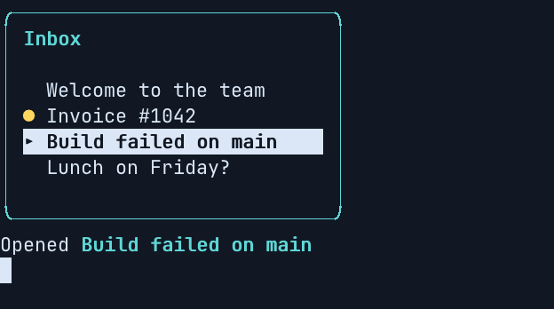

# Bubble Tea: your teatest golden files are your screenshots

If you test a [Bubble Tea](https://github.com/charmbracelet/bubbletea) program with
[teatest](https://github.com/charmbracelet/x/tree/main/exp/teatest), you already have the screens:
`teatest.RequireEqualOutput` keeps everything your program wrote in `testdata/<TestName>.golden`.
Those files are the raw bytes, escape sequences and all, which is exactly what termshot replays.
Point termshot-action at them, and each pull request shows the screens its tests check, with
before and after and a diff of the cells that changed.

There's no recorder and no second set of fixtures, and the screenshots can't drift from the tests:
`go test` fails when a golden is out of date.

This guide uses Bubble Tea v2 (`charm.land/bubbletea/v2`) and `teatest/v2`. The example it quotes
is in [`examples/bubbletea`](../examples/bubbletea), and this repository's
[screens workflow](../.github/workflows/screens.yml) runs it on every pull request.



## 1. Make the golden files screenshot-ready

Three settings, all in one helper:

```go
func newTestModel(t *testing.T) *teatest.TestModel {
	return teatest.NewTestModel(t, newModel(),
		teatest.WithInitialTermSize(48, 12),
		teatest.WithProgramOptions(
			tea.WithColorProfile(colorprofile.TrueColor),
			tea.WithEnvironment([]string{"TERM=xterm-256color"}),
		),
	)
}
```

- **A fixed size.** termshot needs the size the program drew for. You give it the same one,
  `@48x12` below.
- **A colour profile.** A test has no terminal to detect colours from. Without one, Lip Gloss's
  colours can be dropped from the output. `TrueColor` keeps them as you wrote them.
- **A fixed `TERM`.** Bubble Tea picks its escape sequences from the terminal it thinks it's in.
  We ran the same test on macOS in Ghostty and on Linux over ssh (`TERM=dumb`). It drew the same
  screen with different bytes: runs of spaces as `ECH`/`CUF`/`REP` sequences on one, and as
  spaces on the other. The golden made on one machine then failed on the other. Pinning `TERM`
  made the bytes identical on both, whatever `TERM` the shell had.

  termshot drew both versions identically, pixel for pixel. The screenshots compare screens, not
  bytes. Your golden test compares bytes, though, so pin `TERM`.

Then let the golden file have the whole output:

```go
func TestInboxOpen(t *testing.T) {
	tm := newTestModel(t)
	tm.Send(tea.KeyPressMsg{Code: tea.KeyDown})
	tm.Send(tea.KeyPressMsg{Code: tea.KeyDown})
	tm.Send(tea.KeyPressMsg{Code: tea.KeyEnter})
	tm.Send(tea.KeyPressMsg{Code: 'q', Text: "q"})
	out, err := io.ReadAll(tm.FinalOutput(t, teatest.WithFinalTimeout(3*time.Second)))
	if err != nil {
		t.Fatal(err)
	}
	teatest.RequireEqualOutput(t, out)
}
```

**Don't read `tm.Output()` before `FinalOutput`.** `teatest.WaitFor(t, tm.Output(), ...)` consumes
what it reads, so the golden file keeps only what came after. Bubble Tea redraws only the cells
that change, so that remainder doesn't replay to the screen. In our test it was 28 bytes of
teardown and a blank screen. If you need to wait for something, keep a copy of what `WaitFor`
reads:

```go
var seen bytes.Buffer
out := io.TeeReader(tm.Output(), &seen)
teatest.WaitFor(t, out, func(b []byte) bool { return bytes.Contains(b, []byte("Opened")) })
tm.Send(tea.KeyPressMsg{Code: 'q', Text: "q"})
rest, _ := io.ReadAll(tm.FinalOutput(t))
teatest.RequireEqualOutput(t, append(seen.Bytes(), rest...))
```

That gives the same screen as reading it all at the end.

**Draw inline in tests, not in the alternate screen.** A program that sets `View.AltScreen` leaves
the alternate screen when it quits. Its golden file ends with `ESC [ ? 1049 l`, and the last
screen is the empty one underneath. Make full-screen mode something the test can turn off.

Run `go test ./... -update` once to write the golden files, and commit them.

## 2. Add the workflow

The golden files have line feeds without carriage returns: they weren't written through a
terminal, which would have added the CR. So pass `--lf-newline`. Logs are named after their files,
so `TestInboxOpen.golden` is the screen `TestInboxOpen`.

The simplest setup is one job that tests, renders and publishes:

```yaml
# .github/workflows/screens.yml
name: screens
on:
  pull_request:
  push:
    branches: [main]

permissions:
  contents: write        # store the images on the termshot-assets branch
  pull-requests: write   # post the comment

jobs:
  screens:
    runs-on: ubuntu-latest
    steps:
      - uses: actions/checkout@v4
      - uses: actions/setup-go@v7
        with:
          go-version-file: go.mod
      - run: go test ./...                 # fails if a golden file is out of date
      - uses: momiji-rs/termshot-action@v0
        with:
          logs: testdata/*.golden@48x12
          args: --lf-newline
```

To keep your tests out of the job that holds the write token, split it as the
[README](../README.md#why-two-workflows) describes:

- The test job uses `mode: render` with `permissions: {}`.
- A `screens-publish` workflow publishes on `workflow_run`. Give it the same `args: --lf-newline`,
  because it renders the logs again.

That is what this repository does, beside its own demo. A pull request from a fork works the
same way.

## 3. What a pull request shows

Change how the program looks, run `go test ./... -update`, and push. The comment on the pull
request shows each golden file that changed:

- before and after
- the diff image, with the cells that changed at full strength and the rest dimmed, so a
  colour-only change shows too
- the text diff

Unchanged screens fold into one line. A reviewer sees the change without running anything, and
`go test` still guards it.
