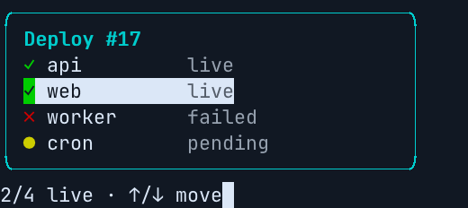

# Ink: the frames your tests check, as pull request screenshots

[Ink](https://github.com/vadimdemedes/ink) programs are tested with
[ink-testing-library](https://github.com/vadimdemedes/ink-testing-library). `lastFrame()` gives
you the whole frame the program drew, as a string. Write it to a file per screen, in colour, and
termshot-action renders those files on every pull request, with before and after and a diff of
the cells that changed. The test still checks the frame, so a screenshot can't drift from it.

This guide uses Ink 8, React 19, ink-testing-library 4 and Vitest 5. Its example is in
[`examples/ink`](../examples/ink), and this repository's
[screens workflow](../.github/workflows/screens.yml) runs it on every pull request.



## 1. Make the frames screenshot-ready

**Force colour.** A test has no terminal, so chalk detects no colour support, and the frame has
no escape sequences at all. In the example that meant 0 escapes instead of 46, and the frame came
out plain. Your tests then can't see a colour change either. Force true colour in
`vitest.config.js`:

```js
import {defineConfig} from 'vitest/config';

export default defineConfig({
  test: {
    env: {FORCE_COLOR: '3'},
  },
});
```

**One file per screen.** `toMatchSnapshot()` keeps the escape sequences, but it wraps every
snapshot of a test file into one `__snapshots__/*.snap` JavaScript module:
``exports[`… 1`] = `"…"`;``. termshot can't replay that. `toMatchFileSnapshot()` writes each frame
as it is, to a file you name:

```jsx
import React from 'react';
import {expect, test, vi} from 'vitest';
import {render} from 'ink-testing-library';
import {App} from './app.jsx';

test('a deploy with a failed service', async () => {
  const app = render(<App />);
  await expect(app.lastFrame()).toMatchFileSnapshot('__screens__/deploy.ansi');
});
```

**Press keys once the app listens.** `useInput` subscribes in an effect, after the first frame is
drawn. A key written straight after `render()` can arrive before anything listens. This helper
waits a tick, then waits for the frame the key draws. It passed 30 runs out of 30:

```jsx
async function press(app, key) {
  await new Promise(resolve => setTimeout(resolve, 0)); // let useInput's effect run
  const before = app.frames.length;
  app.stdin.write(key);
  await vi.waitFor(() => expect(app.frames.length).toBeGreaterThan(before));
}

test('the selection moves down', async () => {
  const app = render(<App />);
  await press(app, '\u001B[B');
  await expect(app.lastFrame()).toMatchFileSnapshot('__screens__/deploy-down.ansi');
});
```

Run `npx vitest run -u` once to write the files, and commit them. A snapshot written on macOS
passed on Linux as it was.

## 2. Add the workflow

Two things decide the termshot options:

- The frame is lines joined by line feeds, without carriage returns (it never went through a
  terminal), so pass `--lf-newline`.
- ink-testing-library lays the app out in 100 columns. Give termshot a size at least as wide as
  your widest line and as tall as the frame. The example's box is 36 wide and 8 lines tall, so
  `@40x8`.

Screens are named after their files, so this one is `deploy-down`.

```yaml
# .github/workflows/screens.yml
name: screens
on:
  pull_request:
  push:
    branches: [main]

permissions:
  contents: write        # store the images on the termshot-assets branch
  pull-requests: write   # post the comment

jobs:
  screens:
    runs-on: ubuntu-latest
    steps:
      - uses: actions/checkout@v4
      - uses: actions/setup-node@v7
        with:
          node-version: 22             # Ink 8 and Vitest 5 need it
      - run: npm ci && npm test        # fails if a frame is out of date
      - uses: momiji-rs/termshot-action@v0
        with:
          logs: src/__screens__/*.ansi@40x8
          args: --lf-newline
```

Under CI, Vitest doesn't write snapshots. We checked both cases:

- A frame that changed failed the test and left the file as it was.
- A missing one failed and wrote nothing.

So a stale screen fails the job.

To keep your tests out of the job that holds the write token, split it as the
[README](../README.md#why-two-workflows) describes:

- The test job uses `mode: render` with `permissions: {}`.
- A `screens-publish` workflow publishes on `workflow_run`. Give it the same
  `args: --lf-newline`.

That is what this repository does.

## 3. What a pull request shows

Change how the program looks, run `npx vitest run -u`, and push. The comment on the pull request
shows each frame that changed:

- before and after
- the diff image, with the cells that changed at full strength and the rest dimmed, so a
  colour-only change shows too
- the text diff
