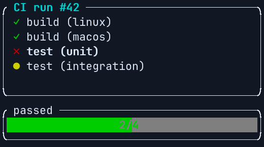

# Ratatui: snapshots that see colour, as pull request screenshots

[Ratatui](https://ratatui.rs) programs are usually tested with `TestBackend` and an
[insta](https://insta.rs) snapshot of the screen. Those snapshots are text:

```text
"╭ CI run #42 ──────────────────────────╮"
"│ ✓ build (linux)                      │"
"│ ✗ test (unit)                        │"
```

They show no colours and no bold, so a change that only restyles the screen passes them. We drew
the failed job magenta instead of red: the text snapshot still passed.

Add one more snapshot per screen: the bytes a terminal would receive, escape sequences and all.
insta keeps them in a file of their own, `*.snap.ansi`. termshot-action renders those files on
every pull request, with before and after and a diff of the cells that changed. With the same
magenta change, this snapshot failed, and the pull request showed the change.

This guide uses Ratatui 0.30 and insta 1.49. Its example is in
[`examples/ratatui`](../examples/ratatui), and this repository's
[screens workflow](../.github/workflows/screens.yml) runs it on every pull request.



## 1. Snapshot what the terminal receives

Draw the frame with Ratatui's own crossterm backend, writing into memory instead of a terminal:

```rust
use ratatui::backend::CrosstermBackend;
use ratatui::layout::Rect;
use ratatui::{Terminal, TerminalOptions, Viewport};
use std::{cell::RefCell, rc::Rc};

/// What a terminal would receive for one frame of `app`.
fn ansi(width: u16, height: u16, app: &App) -> Vec<u8> {
    #[derive(Clone, Default)]
    struct Shared(Rc<RefCell<Vec<u8>>>);

    impl std::io::Write for Shared {
        fn write(&mut self, bytes: &[u8]) -> std::io::Result<usize> {
            self.0.borrow_mut().extend_from_slice(bytes);
            Ok(bytes.len())
        }

        fn flush(&mut self) -> std::io::Result<()> {
            Ok(())
        }
    }

    let out = Shared::default();
    // A fixed viewport, so the terminal never asks the (absent) real one its size.
    let viewport = Viewport::Fixed(Rect::new(0, 0, width, height));
    let mut terminal = Terminal::with_options(CrosstermBackend::new(out.clone()), TerminalOptions { viewport }).unwrap();
    terminal.draw(|frame| ui(frame, app)).unwrap();
    let bytes = out.0.borrow().clone();
    bytes
}
```

The shared writer is there because `CrosstermBackend::writer()` is behind Ratatui's unstable
`backend-writer` feature. This way uses only stable API.

Then, beside the snapshot you already have, add a binary snapshot with a name of its own:

```rust
#[test]
fn a_failed_run() {
    let app = App::new();
    insta::assert_snapshot!(text(40, 10, &app));                            // the usual one
    insta::assert_binary_snapshot!("failed_run.ansi", ansi(40, 10, &app));  // for screenshots
}
```

insta writes `src/snapshots/jobs__tests__failed_run.snap` (its metadata) and
`jobs__tests__failed_run.snap.ansi`, the raw bytes. `cargo insta review` reviews it like any other
snapshot. Name it, because a second unnamed snapshot in the same test gets a `-2` suffix, and the
screen would be named after that.

You don't need to pin anything. crossterm writes the same bytes whatever the terminal, so a
snapshot made on macOS passed on Linux as it was. Ratatui positions every cell with an absolute
cursor move, so there are no line endings to fix either.

**Pick characters your screenshot font has.** termshot draws with JetBrains Mono, unless you give
it `font`. JetBrains Mono has `✓` and `✗`, but not `✔` and `✘`, which come out as boxes. Your
terminal falls back to another font for them, but a screenshot can't guess which.

## 2. Add the workflow

```yaml
# .github/workflows/screens.yml
name: screens
on:
  pull_request:
  push:
    branches: [main]

permissions:
  contents: write        # store the images on the termshot-assets branch
  pull-requests: write   # post the comment

jobs:
  screens:
    runs-on: ubuntu-latest
    steps:
      - uses: actions/checkout@v4
      - run: cargo test --locked           # fails if a snapshot is out of date
      - uses: momiji-rs/termshot-action@v0
        with:
          logs: src/snapshots/*.snap.ansi@40x10
```

GitHub-hosted runners have Rust already. Under CI, insta doesn't accept new snapshots: it writes the
new one beside the old as `.snap.new`, and the test fails, so a stale snapshot fails the job. The size after `@` is the viewport's. Screens
are named after their files, so this one is `jobs__tests__failed_run.snap`.

To keep your tests out of the job that holds the write token, split it as the
[README](../README.md#why-two-workflows) describes:

- The test job uses `mode: render` with `permissions: {}`.
- A `screens-publish` workflow publishes on `workflow_run`.

That is what this repository does.

## 3. What a pull request shows

Change how the program looks, run `cargo insta review` (or `INSTA_UPDATE=always cargo test`), and
push. The comment on the pull request shows each ANSI snapshot that changed:

- before and after
- the diff image, with the cells that changed at full strength and the rest dimmed
- the text diff

For a change of colour alone, the comment says "Same text; colours or attributes changed", which
is exactly the change the text snapshot missed.
